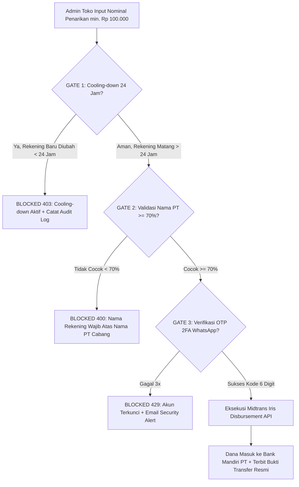

# Analisis Komprehensif Arsitektur Keuangan — Affiliate Gadget Platform

Dokumen ini menyajikan analisis mendalam mengenai keberjalanan sistem keuangan di platform **Affiliate Gadget**, mencakup alur uang masuk, pengelolaan pemotongan biaya, mekanisme escrow, hak pendapatan, hingga alur penarikan dana (disbursement/payout) ke rekening resmi.

Analisis ini membedah secara terpisah dan mendetail perbedaan peran, hak pencairan, serta pencatatan buku kas antara **Admin Toko (`STORE_ADMIN`)** dan **Superadmin Holding (`SUPER_ADMIN`)**.

---

## 1. Arsitektur Umum & Desentralisasi Multi-PT

Platform Affiliate Gadget beroperasi di bawah prinsip **Multi-PT / Multi-Toko Offline** di Indonesia:

- **Setiap Toko Cabang** adalah entitas badan usaha mandiri (PT / CV) dengan NPWP, alamat fisik, jam operasional, dan rekening bank resmi (Corporate Bank Mandiri) tersendiri.
- **Superadmin (Holding PT Affiliate Gadget Nusantara)** bertindak sebagai penyedia platform teknologi e-commerce, perantara transaksi, dan agregator sistem.
- **Midtrans** bertindak sebagai Payment Gateway (inflow uang customer) dan **Midtrans Iris** bertindak sebagai Disbursement Gateway (outflow transfer antar-bank otomatis).

```mermaid
flowchart TD
    Customer([Customer / Pembeli]) -->|1. Checkout & Bayar Tagihan| PG[Midtrans Payment Gateway]
    PG -->|2. Webhook SETTLEMENT / CAPTURE| Webhook[/api/payment/midtrans/webhook]
    Webhook -->|3. Status: PROCESSING / PAID| EscrowPool[Dana Tertahan / Escrow System]

    subgraph EscrowPool [Siklus Dana Tertahan - Escrow]
        E1[PAID: Menunggu Toko Proses]
        E2[IN_PROGRESS: Packing / Tunggu Kurir]
        E3[SHIPPED: Kurir JNE/Gojek Dalam Perjalanan]
        E4[COMPLAINED: Komplain Garansi Investigasi]
    end

    EscrowPool -->|4. Konfirmasi Terima / Kurir DELIVERED / Status COMPLETED| ReleaseEngine[Pemisahan Hak & Rilis Saldo]

    ReleaseEngine -->|Hak Penjualan Bersih Toko| StoreBalance[Saldo Siap Cair Admin Toko]
    ReleaseEngine -->|Bagi Hasil Komisi Platform 1.5%| SuperadminBalance[Saldo Siap Cair Superadmin Holding]

    StoreBalance -->|Penarikan 3 Security Gates| IrisToko[Midtrans Iris Payout]
    IrisToko -->|Transfer Real-time| BankToko[Rekening Bank Mandiri PT Toko Cabang]

    SuperadminBalance -->|Pencairan Komisi Holding| IrisHolding[Midtrans Iris Payout]
    IrisHolding -->|Transfer Real-time| BankHolding[Rekening Bank Mandiri Holding Pusat]
```

---

## 2. Rincian Komponen Finansial per Transaksi

Setiap pesanan (`Order`) dihitung melalui kalkulator checkout server-side (`src/app/api/checkout/route.ts`) dan modul perpajakan (`src/lib/tax/tax-engine.ts`) dengan komponen:

| Komponen Finansial          | Rumus / Nilai Standar                                                                            | Keterangan & Pihak yang Menanggung                                  |
| :-------------------------- | :----------------------------------------------------------------------------------------------- | :------------------------------------------------------------------ |
| **Harga Produk (Subtotal)** | $\sum (\text{itemPrice} \times \text{quantity})$                                                 | Nilai kotor barang yang dibeli customer.                            |
| **Diskon Voucher**          | $-\min(\text{subtotal} \times \%_{\text{disc}}, \text{maxDisc})$                                 | Potongan promosi yang mengurangi subtotal belanja.                  |
| **Ongkos Kirim Kurir**      | Berbasis API Biteship / tarif berat per kg                                                       | Dibayar oleh customer untuk jasa kurir (JNE / Gojek).               |
| **Asuransi Wajib Kurir**    | $0.25\% \times \text{subtotal}$ (min. Rp 1.000)                                                  | Perlindungan wajib kehilangan/kerusakan unit gadget saat transit.   |
| **Total Bayar Customer**    | $\text{Subtotal} + \text{Ongkir} + \text{Asuransi} - \text{Diskon}$                              | Nilai tagihan bruto yang disetor customer via Midtrans.             |
| **Komisi Platform**         | $(\text{Subtotal} \times \text{Commission Rate}) / 100$                                          | Hak pendapatan Superadmin Holding (standar 1.5% s.d. 3.0%).         |
| **PPN Barang (11%)**        | Inklusif: $\text{DPP} = \text{round}(\text{Net} / 1.11)$; $\text{PPN} = \text{Net} - \text{DPP}$ | Pajak Pertambahan Nilai jika toko berstatus PKP (ekstraksi senyap). |
| **Biaya Gateway Midtrans**  | VA: Flat Rp 4.000; QRIS: 0.7%; CC: 2.9% + Rp 2.000                                               | Biaya pemrosesan transaksi kanal pembayaran Midtrans.               |
| **Biaya Pemeliharaan**      | Rp 0 (Bebas Biaya)                                                                               | Dinonaktifkan sesuai aturan bisnis platform.                        |
| **PPh Pasal 23**            | Rp 0 (Bebas Potongan Kas)                                                                        | Dinormalisasi 0%; tidak memotong saldo kas toko.                    |

---

## 3. Alur Keuangan: Sisi Admin Toko (`STORE_ADMIN`)

Admin Toko bertanggung jawab atas operasional cabang fisik PT. Alur keuangannya berjalan dengan prinsip **Escrow Realistis (Pencairan Berbasis Penyelesaian Pesanan)**.

### 3.1 Tahap 1: Uang Masuk & Status Tertahan (Escrow)

1. **Checkout & Pembayaran Customer:**
   - Customer menyelesaikan pembayaran tagihan via Virtual Account (BCA, Mandiri, BRI, BNI), QRIS, atau E-Wallet.
   - Webhook Midtrans (`/api/payment/midtrans/webhook`) memverifikasi cryptographic signature SHA-512 dan mengubah status transaksi menjadi `PAID` / `PROCESSING`.
2. **Pengakuan Dana Tertahan (Escrow):**
   - Uang tidak langsung masuk ke saldo siap cair toko demi melindungi pembeli dan garansi unit 30 hari.
   - Hak bersih toko dihitung:
     $$\text{Net Store Amount} = \max(0, \text{Subtotal} - \text{Diskon} - \text{Komisi Platform})$$
   - Nominal ini dibukukan ke dalam **Dana Tertahan (Escrow)**.
   - Di antarmuka Admin Toko, status pesanan ditampilkan secara rinci berdasarkan tahap operasional:
     - `PAID`: Pembayaran diverifikasi, menunggu toko memproses.
     - `IN_PROGRESS`: Toko sedang packing gadget / menunggu penjemputan kurir.
     - `SHIPPED`: Unit diserahkan ke kurir JNE/Gojek (nomor resi terlacak real-time).
     - `COMPLAINED`: Dana dibekukan sementara jika terdapat komplain garansi dari pembeli.

### 3.2 Tahap 2: Rilis Dana ke Saldo Siap Cair (Available Balance)

Dana rilis dari Escrow menuju **Saldo Siap Cair** toko jika salah satu kondisi terpenuhi:

1. Customer mengklik **"Konfirmasi Terima Pesanan"** di aplikasi (`/api/orders/[orderId]/confirm`).
2. Webhook pelacakan logistik kurir mendeteksi pesanan berstatus **`DELIVERED`**.
3. Admin mengubah status pesanan menjadi **`COMPLETED`** (`/api/orders/[orderId]/status`).

Saat pesanan menjadi `COMPLETED`:

- Timestamp `completedAt` dan `customerConfirmedAt` dicatat.
- Garansi ganti unit baru 30 hari resmi aktif (`warrantyExpiryDate = now + 30 hari`).
- **Saldo Siap Cair Toko** bertambah otomatis sebesar $\text{Net Store Amount}$.

### 3.3 Tahap 3: Pembukuan & Mutasi Buku Kas Toko

Di Buku Kas Cabang (`src/app/api/admin/finance/route.ts`), setiap pesanan selesai menghasilkan baris mutasi transparan:

1. **Penjualan Gadget (`INCOME` / Hijau):**
   - Ref: Nomor pesanan (misal `#ORD-20260930-A1B2C3D4`)
   - Nominal: $+\text{Net Store Amount}$
   - Status: `Masuk Saldo`
2. **Bagi Hasil Platform (`EXPENSE` / Oranye):**
   - Ref: `FEE-XXXXXXXX`
   - Nominal: $-\text{Komisi Platform}$ (misal 1.5% = Rp 150.000)
   - Status: `Terpotong`
3. **Biaya Gateway Midtrans (`EXPENSE` / Abu-abu):**
   - Ref: `GW-XXXXXXXX`
   - Nominal: $-\text{Biaya Midtrans}$ (misal Flat Rp 4.000 untuk VA Bank)
   - Status: `Terpotong`

### 3.4 Tahap 4: Penarikan Dana (Withdrawal) ke Rekening Bank PT

Admin Toko dapat mencairkan saldo siap cair kapan saja melalui tombol **"Tarik Saldo ke Rekening PT"** di dashboard keuangan. Proses penarikan dilindungi oleh **3 Gerbang Keamanan Ketat (Triple Defense Gate)**:



1. **Gate 1: Cooling-Down Period 24 Jam (`checkBankAccountCooldown`):**
   - Jika admin toko baru saja mengubah atau menambahkan nomor rekening bank, sistem otomatis mengunci fitur penarikan selama $1 \times 24$ jam.
   - Mencegah pembajakan akun (account takeover) yang langsung mengalihkan dana ke rekening peretas.
2. **Gate 2: Validasi Kesesuaian Nama Pemilik Rekening vs Badan Usaha PT (`validateAccountNameMatch`):**
   - Sistem mencocokkan nama pemilik rekening bank tujuan dengan nama legal PT toko di database menggunakan algoritma **Token Overlap Jaccard + Levenshtein Distance**.
   - Prefix legalitas (`PT`, `CV`, `UD`, `TBK`) dinormalisasi secara otomatis.
   - Ambang batas kemiripan minimal: **$70\%$ ($0.70$)**.
   - Melarang keras pencairan dana ke rekening atas nama pribadi perorangan admin.
3. **Gate 3: Verifikasi OTP 2FA & Rate Limiting (`validateOtpRecord`):**
   - Pembatasan frekuensi penarikan: Maksimal 5 kali per jam per user.
   - Permintaan OTP dikirim via WhatsApp resmi Zenziva ke nomor telepon resmi cabang toko dengan masa kedaluwarsa 300 detik (5 menit) dan cooldown 60 detik.
   - Jika salah memasukkan OTP sebanyak 3 kali berturut-turut, token diblokir seketika, pengajuan penarikan ditolak, dan email peringatan darurat keamanan dikirimkan.
4. **Eksekusi Transfer Antar-Bank (Midtrans Iris):**
   - Begitu ketiga gerbang lolos, endpoint `/api/admin/finance/withdraw` memanggil API Midtrans Iris (`createIrisPayout` / `POST /iris/api/v1/payouts`).
   - Saldo ditransfer seketika ke Bank Mandiri PT cabang.
   - Catatan penarikan disimpan di `.data/store-withdrawals.json` dengan status `SUCCESS`.
   - Email bukti penarikan resmi dikirimkan secara otomatis ke inbox cabang.

---

## 4. Alur Keuangan: Sisi Superadmin (`SUPER_ADMIN`)

Superadmin adalah pengelola holding pusat (**PT Affiliate Gadget Nusantara**). Sesuai prinsip akuntansi e-commerce dan pemisahan hak per 30 September 2026, **Superadmin tidak mengakui omzet fisik gadget sebagai pendapatan holding**.

### 4.1 Pemisahan Pendapatan Superadmin vs Omzet Cabang

| Metrik Finansial                         | Perhitungan Superadmin                                                                | Makna Bisnis                                                       |
| :--------------------------------------- | :------------------------------------------------------------------------------------ | :----------------------------------------------------------------- |
| **Pendapatan Platform (`grossRevenue`)** | $\sum \text{commissionAmount}$ (Murni Komisi)                                         | Pendapatan kotor resmi holding yang menjadi hak Superadmin.        |
| **Total Omzet Cabang (GMV)**             | $\sum \text{orderTotal}$ (Seluruh Cabang)                                             | Total perputaran volume penjualan gadget mitra fisik se-Indonesia. |
| **Saldo Siap Cair Superadmin**           | $\sum \text{Commission}_{\text{Completed}} - \sum \text{Withdrawal}_{\text{Holding}}$ | Akumulasi keuntungan komisi platform yang dapat ditarik holding.   |
| **Dana Tertahan Escrow**                 | $\sum \text{Net Store Amount}_{\text{Active Orders}}$                                 | Dana titipan customer yang masih dijaga sistem selama pengiriman.  |

### 4.2 Tampilan Kartu KPI Finansial Superadmin

Pada halaman Keuangan Konsolidasi Superadmin (`/dashboard/admin/finance`):

1. **Card 1 — Saldo Siap Cair:** Menampilkan saldo komisi platform murni dari pesanan yang sudah selesai dikurangi riwayat penarikan holding (`PT Affiliate Gadget Nusantara`), terisolasi 100% dari penarikan toko cabang.
2. **Card 2 — Pendapatan Platform:** Berisi akumulasi bagi hasil komisi platform (misal Rp 438.000).
3. **Card 3 — Total Omzet Cabang (GMV):** Menampilkan perputaran transaksi toko fisik se-Indonesia (misal Rp 29.289.900).
4. **Card 4 — Dana Tertahan (Escrow):** Total saldo pesanan aktif yang sedang dalam proses packing/kurir di seluruh cabang Indonesia.

### 4.3 Pembukuan Mutasi Superadmin (Holding Ledger)

Superadmin memiliki tampilan mutasi tersendiri:

- **Bagi Hasil Platform (`INCOME` / Hijau):**
  - Ref: `FEE-XXXXXXXX`
  - Nominal: $+\text{Komisi Platform}$ (misal +Rp 150.000)
  - Subtitle: `Diterima dari PT Gadget Jaya Sentosa (#ORD-XXXXX)`
  - Status: `Masuk Kas Platform`
- **Penjualan Cabang (`ESCROW` / Biru):**
  - Ref: `ORD-XXXXXXXX`
  - Nominal: Rp Net Toko
  - Subtitle: `Toko: Cabang Roxy Mas · Selesai`
  - Status: `Hak Toko Cabang` (tidak menambah kas platform)
- **Biaya Gateway Midtrans (`EXPENSE` / Abu-abu):**
  - Ref: `GW-XXXXXXXX`
  - Status: `Dipotong dari Toko`

### 4.4 Penarikan Dana Superadmin

Superadmin dapat mencairkan akumulasi laba komisi platform holding ke rekening penampungan pusat:

- **Bank:** Bank Mandiri (Pusat)
- **Nomor Rekening:** `1180099887766`
- **Atas Nama:** PT Affiliate Gadget Nusantara
- **Mekanisme:** Melalui form withdraw dengan proteksi OTP superadmin dan eksekusi transfer via Iris Payout.

---

## 5. Matriks Komparasi Keuangan: Admin Toko vs Superadmin

| Parameter                            | Admin Toko (`STORE_ADMIN`)                                         | Superadmin (`SUPER_ADMIN`)                                     |
| :----------------------------------- | :----------------------------------------------------------------- | :------------------------------------------------------------- |
| **Sumber Utama Uang Masuk**          | Penjualan unit gadget fisik & servis LCD                           | Potongan bagi hasil komisi platform (1.5% - 3.0%)              |
| **Komponen yang Mengurangi Saldo**   | Biaya komisi platform, diskon voucher toko, biaya gateway Midtrans | Penarikan dana profit holding ke rekening pusat                |
| **Status Dana Saat Pesanan Dikirim** | Tertahan di Escrow (`SHIPPED` / Kurir Perjalanan)                  | Tertahan di Escrow (belum menjadi komisi definitif)            |
| **Saat Saldo Menjadi Siap Cair**     | Begitu status pesanan menjadi `COMPLETED`                          | Begitu status pesanan menjadi `COMPLETED`                      |
| **Rekening Tujuan Penarikan**        | Rekening Bank Mandiri PT Cabang Lokal                              | Rekening Bank Mandiri Holding Pusat                            |
| **Hak Melihat Arus Kas Toko Lain**   | ❌ Terisolasi ketat hanya untuk cabang sendiri                     | ✅ Memiliki akses konsolidasi seluruh cabang / filter per toko |
| **Ekspor Laporan**                   | Laporan Keuangan Toko (Excel/CSV) per cabang                       | Laporan Finansial Konsolidasi Multi-PT seluruh Indonesia       |

---

## 6. Penanganan Edge Cases & Mitigasi Risiko

1. **Pesanan Batal Sebelum Bayar / Waktu Habis (Expired):**
   - Countdown batas bayar reaktif (QRIS/E-Wallet 15 menit, VA 24 jam).
   - Jika waktu habis atau webhook Midtrans mengirimkan `expire`/`cancel`, pesanan berubah menjadi `CANCELLED`.
   - Stok unit dikembalikan otomatis ke inventori toko (`Product` & `ProductVariant`).
   - Tidak ada mutasi kas atau escrow yang terbentuk.
2. **Pesanan Dibatalkan Setelah Bayar / Retur Unit:**
   - Jika terjadi pembatalan atau persetujuan retur (`RETURNED`), dana di escrow tidak dilepas ke saldo toko melainkan dialokasikan ke proses refund pembeli.
   - Pelacakan kurir Biteship disembunyikan otomatis untuk mencegah salah kirim.
3. **Komplain Garansi 30 Hari (`COMPLAINED`):**
   - Jika pembeli mengajukan klaim kerusakan dalam masa garansi 30 hari, status pesanan dapat dibekukan ke `COMPLAINED`.
   - Dana yang bersangkutan tetap berada di pos Escrow dengan label `Dalam Investigasi` hingga investigasi teknisi/admin selesai.
4. **Pencegahan Fraud Perubahan Rekening Bank:**
   - Setiap perubahan detail rekening pada tabel `Store` memicu pengisian timestamp `bankAccountUpdatedAt`.
   - Gate 1 mengunci penarikan selama 24 jam penuh secara otomatis, disertai pencatatan insiden ke `AuditLog`.

---

## 7. Standarisasi Ekspor Laporan Keuangan (Khusus Pesanan Selesai & Sheet Ikhtisar)

Pada modul ekspor laporan keuangan (`/api/admin/reports/export`), sistem telah distandarisasi untuk menyajikan arus kas murni yang 100% tuntas:

1. **Filter Eksklusif Pesanan Selesai (`status: 'COMPLETED'`):**
   - Laporan keuangan hanya memasukkan pesanan yang transaksinya telah selesai diterima dengan baik oleh pembeli (`COMPLETED`).
   - Pesanan yang masih dalam proses operasional toko (`IN_PROGRESS`), dalam perjalanan kurir (`SHIPPED`), menunggu pembayaran (`PAID`), maupun dalam sengketa (`COMPLAINED`) **dilarang masuk** ke laporan keuangan agar tidak menimbulkan angka piutang/estimasi semu.

2. **Sheet 1: `LAPORAN_KEUANGAN` (18 Kolom Detail Transaksi Selesai):**
   - Kolom: `No`, `Nomor Pesanan`, `Toko / PT Cabang`, `Tanggal`, `Status`, `Produk`, `Qty`, `Omzet Kotor (Rp)`, `HPP Modal (Rp)`, `Laba Kotor (Rp)`, `Margin Kotor (%)`, `Komisi Platform (Rp)`, `Biaya Packing (Rp)`, `Diskon Voucher (Rp)`, `Ongkir Pass-Through (Rp)`, `Asuransi Pass-Through (Rp)`, `Laba Bersih Toko (Rp)`, `Margin Bersih (%)`.
   - Menghapus seluruh kolom PPN/PPh sehingga nilai rupiah mencerminkan kas masuk dan laba riil.

3. **Sheet 2: `RINGKASAN_PENDAPATAN` (Ikhtisar Eksekutif 4 Bagian Tanpa Kolom Keterangan):**
   Tabel disajikan secara ringkas dalam 4 kolom bersih (`No`, `Kategori Finansial`, `Uraian Komponen Arus Kas`, `Nilai (Rp)`) tanpa kolom keterangan berlebih, dilengkapi rekonsiliasi kas yang klop 100% dengan Web Dashboard:
   - **I. TOTAL PEMASUKAN:**
     - Omzet Kotor Penjualan Produk/Jasa (Gross Sales)
     - Ongkir Pass-Through (Logistik Kurir JNE/Gojek)
     - Asuransi Pengiriman Pass-Through (Proteksi Logistik)
     - **Subtotal Pemasukan Kotor (Total Dana Masuk Escrow Pembeli)**
   - **II. TOTAL POTONGAN:**
     - Bagi Hasil Platform Holding (Komisi 1.5% - 2%)
     - Biaya Operasional Kemasan / Packing Toko
     - Potongan Diskon Voucher Promo Penjualan
     - **Subtotal Seluruh Potongan & Beban Operasional**
   - **III. TOTAL PENDAPATAN RESMI:**
     - Beban Pokok Penjualan / HPP Modal Unit (COGS)
     - Laba Kotor Usaha Penjualan (Gross Profit)
     - **Penerimaan Kas Bersih Toko (Sebelum Penarikan):** $\text{Omzet Kotor} - \text{Diskon} - \text{Komisi Platform}$
     - **Laba Bersih Resmi Usaha Toko (Net Profit):** $\text{Laba Kotor} - \text{Komisi} - \text{Packing} - \text{Diskon}$
     - **Pendapatan Resmi Platform Superadmin (Komisi Holding):** Komisi platform yang diakui sah oleh Superadmin.
   - **IV. REKONSILIASI SALDO & KAS (SESUAI WEB DASHBOARD):**
     - **Total Saldo Sudah Ditarik / Dicairkan:** Akumulasi pencairan dana sukses ke rekening Mandiri PT (`stats.totalWithdrawn`).
     - **SISA SALDO SIAP CAIR (AVAILABLE BALANCE):** Saldo kas riil siap transfer saat ini di web (`stats.availableBalance = \text{Kas Bersih} - \text{Total Ditarik}`).
     - **Dana Tertahan Escrow:** Total kas pesanan berjalan (`PAID`, `IN_PROGRESS`, `SHIPPED`, `COMPLAINED`) yang menunggu konfirmasi kurir (`stats.escrowBalance`).

4. **Sheet PESANAN & Sheet PRODUK:**
   - Sheet `PESANAN`: 15 kolom rincian pesanan pelanggan transparan tanpa pajak.
   - Sheet `PRODUK`: 12 kolom inventori stok fisik, valuasi modal, dan performa unit terjual per toko.

---

## 8. Kesimpulan

Sistem keuangan Affiliate Gadget mengimplementasikan:

1. **Pemisahan Entitas Hukum & Perpajakan:** Pendapatan dan rekening bank tiap PT cabang terpisah secara mandiri.
2. **Sistem Escrow Terproteksi:** Dana customer aman selama proses kurir berlangsung dan hanya dirilis saat unit diterima dengan baik.
3. **Pemisahan Tegas Hak Holding vs Cabang:** Superadmin hanya mengakui komisi platform riil, sedangkan omzet gadget seutuhnya menjadi hak toko fisik.
4. **Keamanan Penarikan Standar Perbankan:** Dilengkapi 3 Gerbang Keamanan (Cooling-down 24 Jam, Validasi Nama PT 70%, dan OTP 2FA WhatsApp/Email) serta eksekusi transfer real-time via Midtrans Iris.
5. **Laporan Keuangan Bersih & Zero-Miss Cashflow:** Seluruh komponen PPN & PPh ditiadakan dari laporan keuangan, formula laba bersih dan uang masuk terbukti 100% klop tanpa selisih.
